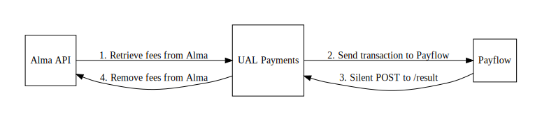

---
layout: default
title: Architecture
---

Architecture
========================

The UAL Payments application acts as a bridge between the Alma API and Payflow Link systems.  Here's a brief overview of
how a successful transaction is processed:

1. Once the user is logged in (either using Shibboleth or an Alma account), the payments application retrieves a list of fees from the Alma API for that user.
2. The user selects which fee(s) they want to pay and they are bundles into a transaction containing a total amount.  The user is then sent to Payflow to pay the
transaction.
3. If the user's credit card information is valid, a "silent POST" request is sent to the `/result` endpoint of the application by Payflow indicating that the payment succeeded.
4. The UAL payments application then looks up which fees were associated with the transaction and removes them from Alma. 

